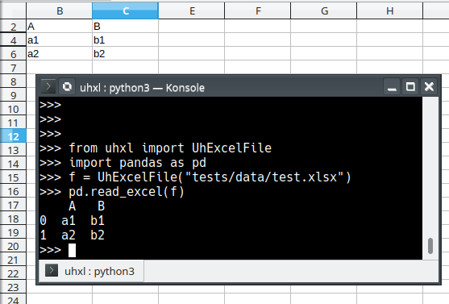

# uhxl
Excel parser into pd.DataFrame. Can read only visible sheets, columns and rows.

Usage:
```python
import pandas as pd
from uhxl import UhExcelFile
excel_file = UhExcelFile("path/to/file.xlsx")
df = pd.read_excel(excel_file)
```

Example:




You can still use read_excel with `usecols` argument, but hidden columns will be ignored anyway.
